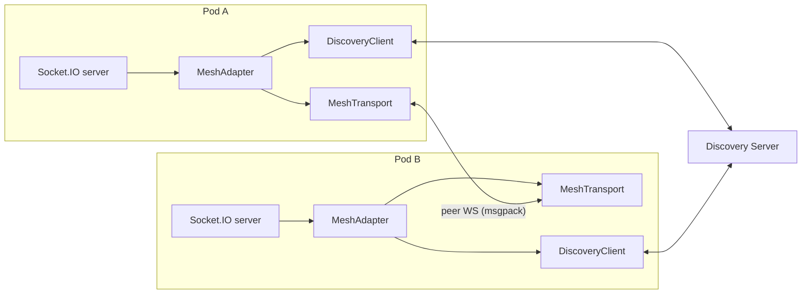

# socket.io-mesh-adapter v2

## Goals

- Cut [src/mesh-adapter.ts](src/mesh-adapter.ts) from 1071 LoC of duplicated send-loops / pending-request bookkeeping down to ~50 LoC by extending `ClusterAdapterWithHeartbeat` (already exported by `socket.io-adapter@2.5.6`, your existing dep).
- Implement the missing `broadcastWithAck` and clean up `addAll`/`delAll` semantics (they correctly stay local, like the Redis adapter — just need to be documented properly).
- Make peer connect/disconnect robust with the heartbeat mechanism + identity handshake + single connection per peer pair.
- Keep the public surface stable: `createAdapter({ wsPort, serverAddress, discoveryServiceAddress })` still works the same.

## Architecture after refactor




`MeshAdapter` subclasses `ClusterAdapterWithHeartbeat` and only implements two methods: `doPublish(msg)` (send to all peers) and `doPublishResponse(uid, resp)` (send to one peer by uid). The base class handles broadcast, broadcastWithAck, fetchSockets aggregation, socketsJoin/Leave, disconnectSockets, serverSideEmit, request/response correlation, timeouts, and heartbeat-driven peer liveness.

# Phase 1 — Foundation (detailed)

## 1. Bump dependencies to latest (do this first)

Update [package.json](package.json):

Runtime:

- `@msgpack/msgpack` ^3.1.1 -> ^3.1.3
- `socket.io` ^4.8.1 -> ^4.8.3
- `socket.io-adapter` ^2.5.5 -> ^2.5.6 (this is where `ClusterAdapterWithHeartbeat` lives)
- `uuid` ^11.1.0 -> ^14.0.0 (note: also we can drop `uuid` entirely once we extend `ClusterAdapterWithHeartbeat` since uid generation is handled by the base class)
- `ws` ^8.18.1 -> ^8.20.0
- Remove the self-dependency `"socket.io-mesh-adapter": "^0.0.2"` ([package.json](package.json) line 39).
- Add `debug` ^4.4.3 (new — for structured logging).

Dev:

- `typescript` ^5.8.3 -> ^6.0.3
- `@types/ws` ^8.18.1 (already latest)
- `@types/express` ^5.0.1 (already latest; only needed for the demo `server.ts`)
- Add `@types/node` ^25.6.2 and `@types/debug` ^4.1.13.
- Replace `ts-node` + `vite-node` + `nodemon` with `tsx` ^4.21.0 (smaller and faster; rewrite `dev` scripts to `tsx watch server.ts` and `tsx watch src/discovery-server.ts`).

After bumping, run `tsc` to surface any breaking changes (mostly TypeScript 6 stricter checks); fix in the cleanup step.

## 2. Split [src/mesh-adapter.ts](src/mesh-adapter.ts) into focused modules

- `src/transport/mesh-transport.ts` — owns the `WebSocketServer`, manages outbound + inbound peer connections, msgpack encode/decode, identity handshake, backpressure (`ws.bufferedAmount` threshold). Exposes:
  ```ts
  class MeshTransport extends EventEmitter {
    constructor(opts: { uid: ServerId, wsPort: number })
    addPeer(uid: ServerId, address: string): void
    removePeer(uid: ServerId): void
    sendToAll(buf: Buffer): void
    sendToPeer(uid: ServerId, buf: Buffer): void
    close(): Promise<void>
    // emits: 'message' (buf, fromUid), 'peer-up' (uid), 'peer-down' (uid)
  }
  ```
- `src/discovery/discovery-client.ts` — connects to discovery server, registers, listens for `update`, emits `peer-list-changed`. Adds exponential backoff (currently constant 1s in [src/mesh-adapter.ts:339](src/mesh-adapter.ts)).
- `src/discovery/discovery-server.ts` — refactor of [src/discovery-server.ts](src/discovery-server.ts): replace `console.log(JSON.stringify(...))` per-message with `debug` package, add WS ping/pong, optional shared-secret auth via env var.
- `src/mesh-adapter.ts` — thin subclass:
  ```ts
  export class MeshAdapter extends ClusterAdapterWithHeartbeat {
    constructor(nsp, private transport: MeshTransport, opts) { super(nsp, opts) }
    protected async doPublish(msg: ClusterMessage): Promise<Offset> {
      this.transport.sendToAll(encode(msg)); return ""
    }
    protected async doPublishResponse(uid: ServerId, resp: ClusterResponse) {
      this.transport.sendToPeer(uid, encode(resp))
    }
  }
  ```
- `src/index.ts` — `createAdapter(opts)` factory that wires transport + discovery + adapter and returns the adapter factory socket.io expects. Also re-exports `MeshAdapter`, `MeshTransport`, `DiscoveryClient` for advanced users / monkey-patching.

## 3. Fix the per-process singleton bug

Today `MeshAdapter.shared` ([src/mesh-adapter.ts:49-56](src/mesh-adapter.ts)) is a static singleton keyed by nothing — so two Socket.IO servers in the same process with different `wsPort` would clobber each other. Replace with a `Map<number, MeshContext>` keyed by `wsPort`, owned by `createAdapter`. Important for tests and multi-tenant.

## 4. Peer connectivity improvements

- **Identity handshake**: when an outbound peer WS opens, send `{ type: HELLO, uid }` first. Receivers map incoming `ws` → `uid` so `doPublishResponse(uid, ...)` works. Currently there's no way to look up an incoming WS by uid.
- **One connection per pair**: only the node with the lexicographically smaller `uid` initiates the connection. Halves FDs (currently both ends open: see [src/mesh-adapter.ts:389-414](src/mesh-adapter.ts)).
- **Backpressure**: before each `ws.send`, check `ws.bufferedAmount`. If above threshold (e.g. 16 MB), drop the peer and log; let discovery + heartbeat handle re-establishing.

## 5. Node lifecycle

- Heartbeat-driven liveness (`ClusterAdapterWithHeartbeat`, 5s interval / 10s timeout by default). Replaces today's reliance on discovery's `update` message being the only source of truth.
- Graceful shutdown: on `close()` emit `ADAPTER_CLOSE` (base class does this), close discovery WS, close own WSS, drop peer connections. Current [src/mesh-adapter.ts:1038-1070](src/mesh-adapter.ts) `close()` doesn't notify peers.
- Exponential backoff reconnect for discovery (1s → 2s → 4s ... cap 30s) instead of fixed 1s loop.

## 6. Code quality

- Replace all `console.log` with `debug("socket.io-mesh-adapter:transport")` etc. (matches Redis/Mongo adapter conventions; gated by `DEBUG` env var). Hot-path logging today (e.g. [src/mesh-adapter.ts:143](src/mesh-adapter.ts), [:169](src/mesh-adapter.ts), [:213](src/mesh-adapter.ts)) is a meaningful perf cost.
- Strict types: discriminated unions for messages, no more `Record<string, any>` for `pendingFetchSockets` (gone entirely after refactor).
- Drop the asymmetric compression code path ([src/mesh-adapter.ts:192-202](src/mesh-adapter.ts) compresses on send but [:144-150](src/mesh-adapter.ts) never decompresses) — re-introduce as a transport option later if needed. msgpack alone is compact.
- Drop the `socket.rooms` Promise hack ([README:114-120](README.md), [src/mesh-adapter.ts:791-845](src/mesh-adapter.ts)) — it mutates a sync socket.io API into a Promise. Replace with `io.fetchSockets({ rooms: ['x'] })` which is the standard way and works across the mesh via the base class.

## 7. Docs

- Update [README.md](README.md):
  - Remove "not implemented" section about `addAll`/`delAll`/`broadcastWithAck` (replace with a short note explaining why `addAll`/`delAll` stay local — same reason as Redis adapter).
  - Drop the `socket.rooms` Promise hack section.
  - Add a Migration from v1 section (one breaking change: `socket.rooms` is sync again; use `fetchSockets({ rooms })` for cross-mesh).
  - Architecture diagram update.

## 8. Tests (LAST — deferred so it doesn't block main refactor)

Hold this until everything above is in and demoable. During development we'll smoke-test manually via [server.ts](server.ts) + the existing `dev` / `dev1` scripts.

Once the refactor is stable, add `tests/`:

- `transport.test.ts`: peer connect/handshake/disconnect/backpressure (2-node and 5-node).
- `discovery.test.ts`: reconnect + update flow.
- `adapter.test.ts`: against a real 3-node mesh — broadcast, fetchSockets, broadcastWithAck, socketsJoin, socketsLeave, disconnectSockets, serverSideEmit (with and without ack).
- Use `vitest` ^4.1.5 (modern, fast, ESM-native; we already use `vite-node` so the ecosystem fits).
- Add `npm test` script + GitHub Actions CI workflow (`.github/workflows/test.yml`).

# Phase 2 — Standout features (outlined)

To be planned in detail after Phase 1 ships:

- **Plugin API for custom methods** (`socket.customMethod(...)`): expose `adapter.registerMessageHandler(type, handler)` + `adapter.publishCustom(type, payload, opts)` so users can layer business-specific cross-mesh RPCs on top of the transport without subclassing. Provide a `useCustomMethod(io, name, handler)` helper that augments the Socket prototype safely.
- **Prometheus metrics per node**: counters for messages sent/received by type, peers up, peer-down events, backpressure drops; histograms for request latency (fetchSockets, broadcastWithAck). Exposed on a configurable HTTP port (e.g. `metricsPort: 9090`), `/metrics` endpoint.
- **Discovery server metrics**: `/metrics` for active server count, registrations/sec.
- **Sample Grafana dashboard JSON** under `examples/grafana/dashboard.json` plus a screenshot.
- **Discovery HA** (stretch): support `discoveryServiceAddresses: string[]` with failover, document running multiple discovery pods behind a K8s headless service.

# Out of scope for v2

- Connection state recovery / offset tracking (would require a durable log; skip unless users ask).
- Sharded rooms (the mesh's whole point is broker-less broadcast; sharding would change the value prop).
- Replacing `ws` with `uWebSockets.js` for the peer transport (potential 5x perf, but adds native deps; flag as future spike).

# Sequencing

1. Bump all dependencies to latest, swap toolchain to `tsx`, fix self-dep — surface any TS 6 / API breaks before refactor work.
2. Land module split + new transport + identity handshake (no behavior change in user-visible API).
3. Wire `ClusterAdapterWithHeartbeat` subclass; delete old per-method send loops and `pendingFetchSockets`.
4. Lifecycle + code-quality cleanups.
5. Update docs and bump major version (`2.0.0`).
6. Smoke-test via [server.ts](server.ts) + `dev` / `dev1` scripts across each step above (no automated tests yet, by request).
7. Add tests as the final step — once the refactor is stable, retroactively add `vitest` coverage and CI workflow.
8. Phase 2 in a follow-up.

