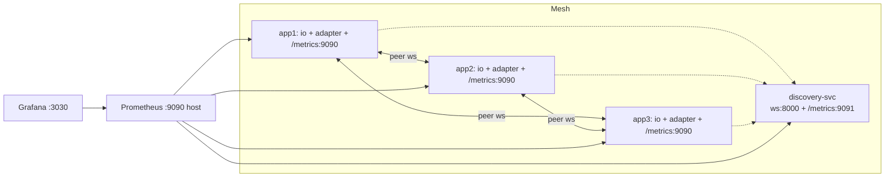

# Phase 2 — Monitoring

This plan implements section 2 of [docs/PHASE2.md](docs/PHASE2.md) (Prometheus metrics) and packages it into a runnable docker-compose stack. Phase 2 plugin API and discovery HA stay separate and follow later.

## Architecture




## Design choices (baked into the plan)

- `prom-client` as a regular runtime dep (~50 KB, no transitive deps). Avoids the "cannot find module" footgun of optional peer deps.
- All metrics emission goes through a thin `MetricsRegistry` interface. When `metrics` option is omitted, a `NoopMetricsRegistry` is plumbed in — zero allocation on hot paths.
- Metrics HTTP server is opt-in via `metrics: { port: 9090 }`. If `metrics` is omitted, no HTTP server is created and `prom-client` is never imported.
- Discovery server metrics opt-in via `METRICS_PORT` env var or `metricsPort` option.
- Grafana datasource + dashboard are **provisioned** (config files mounted into the container) so `docker compose up` requires zero clicks.

## Part A — Adapter-side metrics

### A1. New module `[src/metrics.ts](src/metrics.ts)`

Exports:

```ts
export interface MetricsRegistry {
  peerUp(uid: string): void;
  peerDown(uid: string, reason: string): void;
  expectedPeersChanged(n: number): void;
  messageSent(type: number, bytes: number): void;
  messageReceived(type: number, bytes: number): void;
  requestStarted(kind: "fetchSockets" | "broadcastWithAck" | "serverSideEmit"): () => void; // returns stop()
  localClientsChanged(n: number): void;
  namespacesChanged(n: number): void;
  /** Build a Node http.RequestListener that serves Prometheus text format. */
  handler(): (req: IncomingMessage, res: ServerResponse) => void;
}
export class PromMetricsRegistry implements MetricsRegistry { /* prom-client backed */ }
export const NoopMetricsRegistry: MetricsRegistry = { /* all no-ops */ };
```

The Prom variant defines (matching the table in [docs/PHASE2.md](docs/PHASE2.md)):

- `socketio_mesh_peers_connected` (Gauge)
- `socketio_mesh_peers_expected` (Gauge)
- `socketio_mesh_messages_sent_total` (Counter, label `type`)
- `socketio_mesh_messages_received_total` (Counter, label `type`)
- `socketio_mesh_message_bytes` (Histogram, label `direction`)
- `socketio_mesh_request_duration_seconds` (Histogram, label `kind`)
- `socketio_mesh_peer_drops_total` (Counter, label `reason`)
- `socketio_mesh_namespaces` (Gauge)
- `socketio_mesh_io_clients` (Gauge)

`type` label uses the numeric `MessageType` from `socket.io-adapter` converted to its name (`broadcast`, `heartbeat`, `fetch_sockets`, ...). A tiny `MESSAGE_TYPE_NAMES` lookup map sits in [src/metrics.ts](src/metrics.ts).

### A2. New options in [src/types.ts](src/types.ts)

```ts
export interface MetricsOptions {
  /** If set, an HTTP /metrics server is started on this port. */
  port?: number;
  /** If true, no auto-server is created; use adapter.metrics.handler() yourself. */
  handlerOnly?: boolean;
  /** Override the default registry (advanced). */
  registry?: MetricsRegistry;
}

export interface MeshAdapterOptions extends ClusterAdapterOptions {
  // ...existing...
  metrics?: MetricsOptions;
}
```

### A3. Wire emission points

- [src/transport/mesh-transport.ts](src/transport/mesh-transport.ts): accept `metrics: MetricsRegistry` in `MeshTransportOptions`. Call `metrics.peerUp/peerDown` (replacing `dropPeer`'s existing log-only path with `metrics.peerDown(uid, reason)`), and `metrics.messageSent/Received` with `(type, frame.byteLength)` in `unicast` and the `mesh-frame` handler. The type byte is already in the frame envelope; for sent frames we know the type at the call site (pass through).
- [src/mesh-context.ts](src/mesh-context.ts): owns the registry; subscribes to `discovery.peer-list` to update `expectedPeersChanged(list.length - 1)`; updates `namespacesChanged(adapters.size)` in `register/unregisterAdapter`. Exposes `metrics: MetricsRegistry` so the adapter can use it.
- [src/mesh-adapter.ts](src/mesh-adapter.ts): wraps `doPublish`/`doPublishResponse` to emit `messageSent(type, bytes)` after encoding. Wraps `fetchSockets` / `serverSideEmit` / `broadcastWithAck` overrides to call `metrics.requestStarted(kind)()` around them — the simplest way is to override these methods, time them, and delegate to `super`. Also samples `io.local.fetchSockets().length` on a 5-second interval into `localClientsChanged()`.

### A4. HTTP server bootstrapping

A new tiny module [src/metrics-server.ts](src/metrics-server.ts) wraps `http.createServer` for `/metrics` (text/plain; charset=utf-8), returning a `{ close(): Promise<void> }`. Used by [src/mesh-context.ts](src/mesh-context.ts) when `metrics.port` is set; closed in `ctx.close()`.

### A5. Tests

Add `tests/metrics.test.ts` with two cases:

- Boot a 2-node mesh with metrics on dynamic ports. Issue 1 broadcast and 1 fetchSockets, then `fetch` each node's `/metrics` and assert the expected counter increments + the gauges are 1 (peers_connected).
- Boot 1 node with `metrics` omitted; assert prom-client is *not* loaded (`require.cache` check) and no extra port is listening.

## Part B — Discovery-server metrics

Add to [src/discovery/discovery-server.ts](src/discovery/discovery-server.ts):

- `DiscoveryServerOptions.metricsPort?: number`
- Track:
  - `socketio_mesh_discovery_servers_registered` (Gauge)
  - `socketio_mesh_discovery_registrations_total` (Counter)
  - `socketio_mesh_discovery_disconnects_total` (Counter)
  - `socketio_mesh_discovery_roster_broadcasts_total` (Counter)
- CLI: read `METRICS_PORT` env var (default unset → off) and pass to `startDiscoveryServer`.

## Part C — Docker example

Replace [examples/docker/docker-compose.yml](examples/docker/docker-compose.yml) and add supporting files:

```
examples/docker/
  docker-compose.yml          # discovery + app1/2/3 + prometheus + grafana
  prometheus/
    prometheus.yml            # scrape config for 4 targets
  grafana/
    provisioning/
      datasources/prometheus.yml
      dashboards/mesh.yml
    dashboards/
      socket-io-mesh.json     # the dashboard described below
  README.md                   # how to run + what to look at
```

### docker-compose.yml (sketch)

```yaml
services:
  discovery:
    build: { context: ../.., target: discovery-svc }
    environment:
      METRICS_PORT: "9091"
    ports: [ "8000:8000", "9091:9091" ]

  app1: &app
    build: { context: ../.., target: app }
    environment:
      PORT: "3000"
      MESH_WS_PORT: "4000"
      MESH_WS_IP: app1
      MESH_DISCOVERY_SERVICE_ADDRESS: ws://discovery:8000
      MESH_METRICS_PORT: "9090"
    depends_on: [ discovery ]
    ports: [ "3000:3000" ]
  app2:
    <<: *app
    environment:
      PORT: "3000"
      MESH_WS_PORT: "4000"
      MESH_WS_IP: app2
      MESH_DISCOVERY_SERVICE_ADDRESS: ws://discovery:8000
      MESH_METRICS_PORT: "9090"
    ports: [ "3001:3000" ]
  app3:
    <<: *app
    environment:
      PORT: "3000"
      MESH_WS_PORT: "4000"
      MESH_WS_IP: app3
      MESH_DISCOVERY_SERVICE_ADDRESS: ws://discovery:8000
      MESH_METRICS_PORT: "9090"
    ports: [ "3002:3000" ]

  prometheus:
    image: prom/prometheus:latest
    volumes: [ "./prometheus:/etc/prometheus:ro" ]
    ports: [ "9090:9090" ]
    depends_on: [ app1, app2, app3, discovery ]

  grafana:
    image: grafana/grafana:latest
    environment:
      GF_AUTH_ANONYMOUS_ENABLED: "true"
      GF_AUTH_ANONYMOUS_ORG_ROLE: "Admin"
      GF_USERS_DEFAULT_THEME: "dark"
    volumes:
      - "./grafana/provisioning:/etc/grafana/provisioning:ro"
      - "./grafana/dashboards:/var/lib/grafana/dashboards:ro"
    ports: [ "3030:3000" ]
    depends_on: [ prometheus ]
```

### prometheus.yml

```yaml
global:
  scrape_interval: 5s
scrape_configs:
  - job_name: socketio-mesh
    static_configs:
      - targets: [app1:9090, app2:9090, app3:9090]
        labels: { component: app }
  - job_name: socketio-mesh-discovery
    static_configs:
      - targets: [discovery:9091]
        labels: { component: discovery }
```

### Grafana provisioning

- `grafana/provisioning/datasources/prometheus.yml`: declares the Prometheus datasource at `http://prometheus:9090`.
- `grafana/provisioning/dashboards/mesh.yml`: tells Grafana to load JSON dashboards from `/var/lib/grafana/dashboards`.
- `grafana/dashboards/socket-io-mesh.json`: a dashboard with these panels:
  1. **Peers connected per pod** (time-series): `socketio_mesh_peers_connected{job="socketio-mesh"}` per `instance`.
  2. **Mesh health** (stat): `sum(socketio_mesh_peers_connected) / sum(socketio_mesh_peers_expected)` as a percentage.
  3. **Messages/sec by type** (stacked): `sum by (type) (rate(socketio_mesh_messages_sent_total[1m]))`.
  4. **Request latency p50/p95/p99**: from `socketio_mesh_request_duration_seconds_bucket` per `kind`.
  5. **Frame size distribution**: `histogram_quantile(...)` over `socketio_mesh_message_bytes_bucket`.
  6. **Peer drops by reason** (table): `increase(socketio_mesh_peer_drops_total[5m])`.
  7. **Discovery roster** (gauge): `socketio_mesh_discovery_servers_registered`.
  8. **Local clients per pod** (time-series): `socketio_mesh_io_clients`.

### examples/docker/README.md

Concise walkthrough: `docker compose up --build`, then open:

- `http://localhost:3000` / `3001` / `3002` for the chat demo on each pod
- `http://localhost:9090` for Prometheus
- `http://localhost:3030` for Grafana (auto-loads "Socket.IO Mesh" dashboard)

Section on what to try: send a chat message → watch `messages_sent_total` tick on the originating pod; `docker kill examples-docker-app3-1` → watch `peers_connected` drop on the survivors then recover after `docker compose up app3`.

## Part D — Wire metrics through [server.ts](server.ts)

Update the demo server to enable metrics when `MESH_METRICS_PORT` is set:

```ts
io.adapter(createAdapter({
  wsPort, serverAddress, discoveryServiceAddress,
  metrics: process.env.MESH_METRICS_PORT
    ? { port: parseInt(process.env.MESH_METRICS_PORT, 10) }
    : undefined,
}));
```

This keeps backward-compatible behavior (no env var → no metrics server).

## Part E — README updates

Add a short "Monitoring" section in [README.md](README.md) pointing to `examples/docker` with a screenshot placeholder for the dashboard. Add a `metrics` option row in the options table.

## Part F — Update [docs/PHASE2.md](docs/PHASE2.md)

Strike-through or mark complete the "Prometheus metrics" section and "Sample Grafana dashboard"; keep the Plugin API and Discovery HA sections for future work.

# Sequencing

1. Add `prom-client` dep, write [src/metrics.ts](src/metrics.ts) + [src/metrics-server.ts](src/metrics-server.ts) with the registry interfaces. Confirm `tsc` clean.
2. Plumb the registry through [src/mesh-context.ts](src/mesh-context.ts), [src/transport/mesh-transport.ts](src/transport/mesh-transport.ts), [src/mesh-adapter.ts](src/mesh-adapter.ts). Run existing tests — must still pass.
3. Add `tests/metrics.test.ts`.
4. Add discovery-server metrics + `METRICS_PORT` CLI.
5. Update [server.ts](server.ts) to pass through the env var.
6. Rewrite [examples/docker/docker-compose.yml](examples/docker/docker-compose.yml) and add `prometheus/`, `grafana/`, `README.md`.
7. `docker compose up --build` to smoke-test the stack manually; capture a screenshot for the README later.
8. Update [README.md](README.md) and [docs/PHASE2.md](docs/PHASE2.md).

# Out of scope (still)

- Plugin API for custom methods — separate Phase 2 work item.
- Discovery HA — separate Phase 2 work item.
- Replacing `ws` with `uWebSockets.js`.

