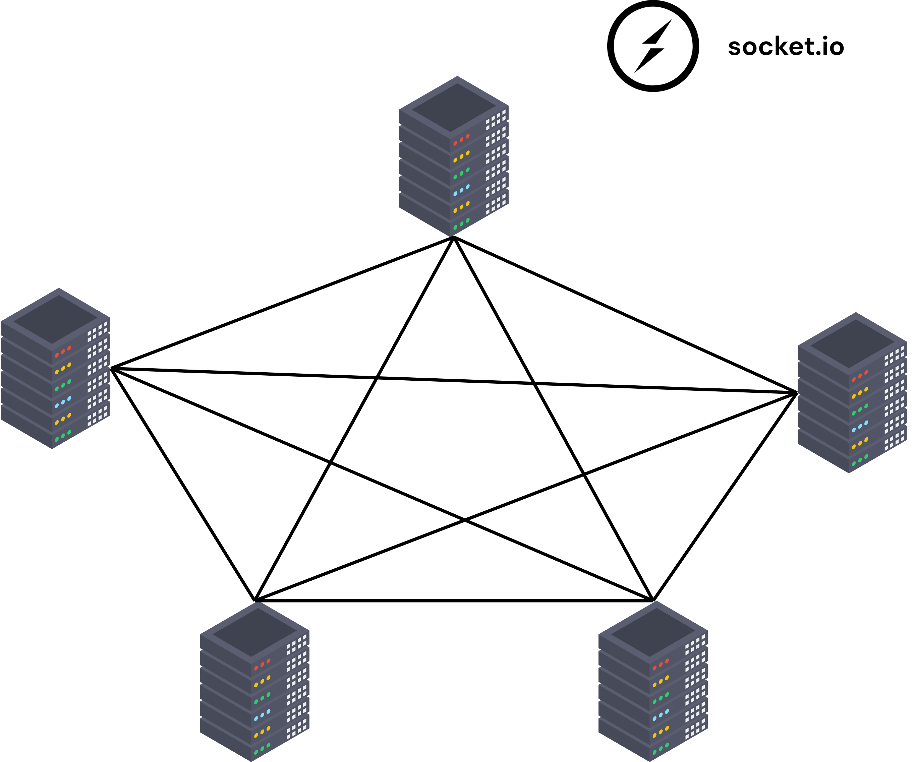
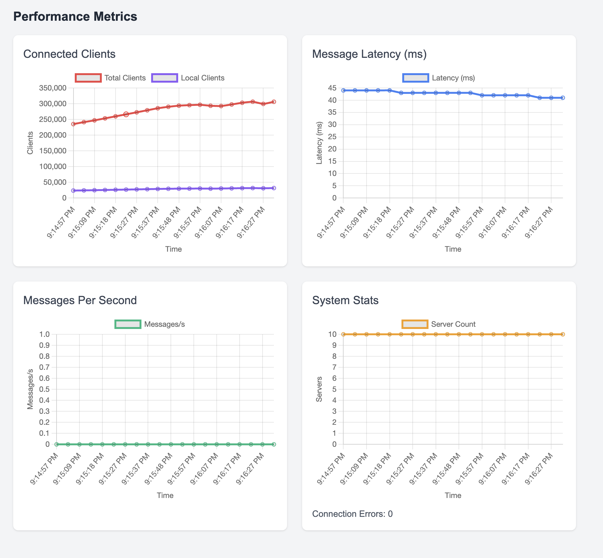
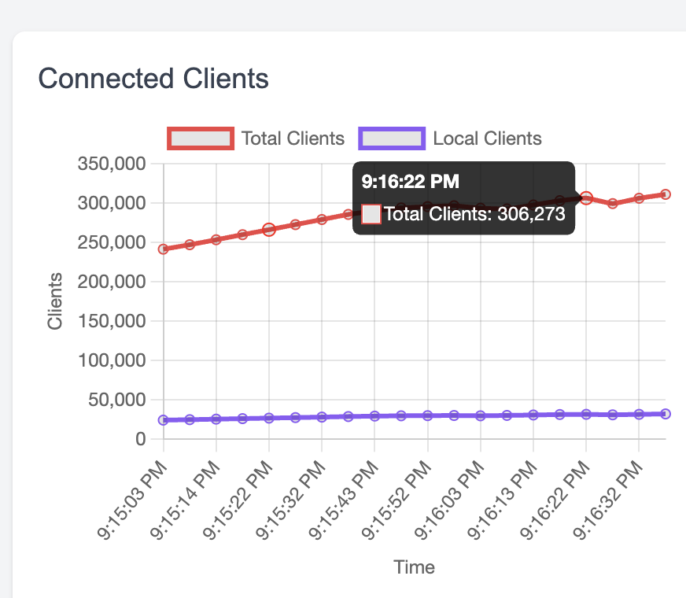
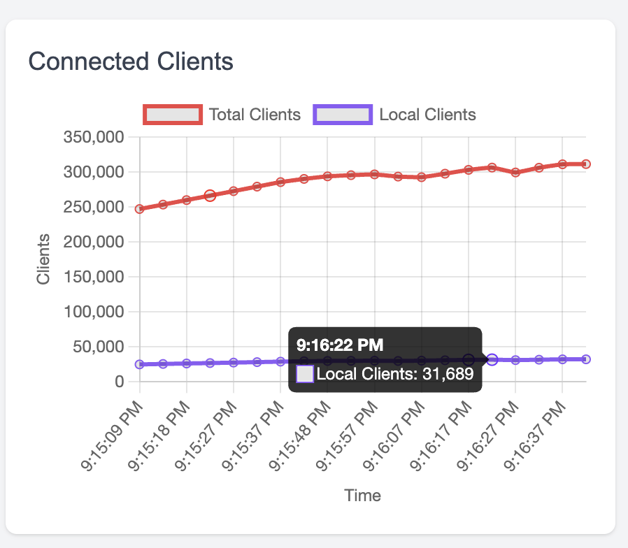
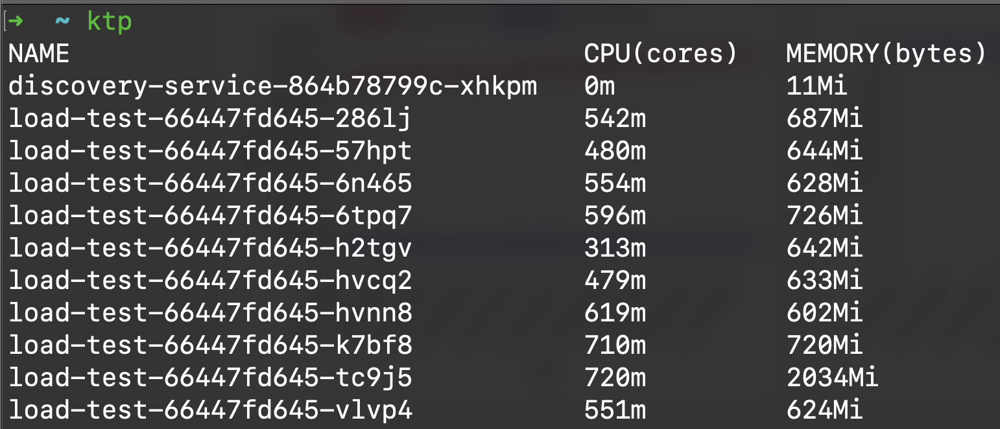
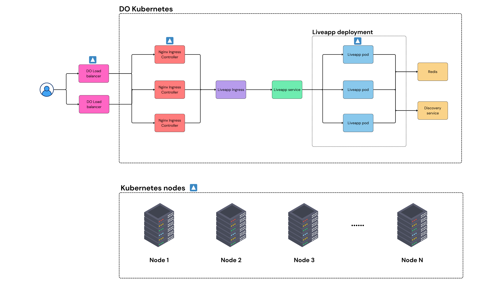

# socket.io-mesh-adapter

> The first Socket.IO adapter that truly scales horizontally — no Redis, no broker, no single point of contention.

# Table of Contents

- [Intro](#intro)
- [Features](#features)
- [Installation](#installation)
- [Usage](#usage)
  * [Running the Discovery Service](#running-the-discovery-service)
  * [Setting Up the Adapter](#setting-up-the-adapter)
- [Options](#options)
- [Benchmark](#benchmark)
- [Monitoring](#monitoring)
- [Examples](#examples)
- [Customization](#customization)
- [Migration from v1](#migration-from-v1)
- [Performance Tips](#performance-tips)
- [Architecture](#architecture)

# Intro



`socket.io-mesh-adapter` is a Socket.IO adapter for horizontally scaling your Socket.IO application using a **mesh network architecture**. Unlike traditional pub/sub-based adapters (Redis, NATS, Postgres, Mongo) that funnel every message through a central broker — which becomes the bottleneck at scale — this adapter has servers talk **directly** to each other over WebSocket. There is no broker, only a tiny **discovery service** that helps peers find each other on startup.

Internally, the adapter extends the official [`ClusterAdapterWithHeartbeat`](https://github.com/socketio/socket.io/tree/main/packages/socket.io-adapter) base class shipped with `socket.io-adapter`, so it inherits the exact same multi-server semantics (broadcast, broadcastWithAck, fetchSockets, socketsJoin/Leave, disconnectSockets, serverSideEmit, heartbeat-driven peer liveness) as the official Redis / Postgres / Mongo adapters. The only thing replaced is the *transport*: instead of a broker, peers exchange msgpack-encoded frames over a fully-meshed WebSocket network.

# Features

- **Horizontal scaling without a broker** — proven to over 300k concurrent connections on Kubernetes.
- **Peer-to-peer mesh transport** — servers connect directly via WebSocket.
- **Discovery service** — a small standalone process helps new pods find existing peers; it is **not** on the message hot path.
- **Built on the official `ClusterAdapterWithHeartbeat`** — full feature parity with the Redis/Mongo adapters, including `broadcastWithAck`.
- **Heartbeat-driven peer liveness** — dead pods are detected and dropped automatically; the mesh self-heals.
- **Single connection per peer pair** — the node with the lex-smaller UID initiates; halves file descriptors compared to v1.
- **Backpressure-aware** — slow peers are dropped before they cause out-of-memory.
- **Identity handshake on every connection** — receivers know which peer is on the other end of an incoming socket.
- **Exponential backoff reconnects** — both discovery and peer reconnects use jittered exponential backoff.
- **Built-in Prometheus metrics** — opt-in `/metrics` endpoint with peer counts, message rates by type, request latency histograms, and peer-drop reasons. Includes a pre-provisioned Grafana dashboard.

# Installation

```bash
npm install socket.io-mesh-adapter
```

# Usage

## Running the Discovery Service

The discovery service maintains the roster of active mesh nodes. Start it **before** your app servers.

```bash
npx socket.io-mesh-adapter@latest
```

It listens on `8000` by default. Override via the `PORT` env var. Optional shared-secret authentication is enabled by setting `MESH_AUTH_TOKEN` on both the discovery server and the adapter clients.

## Setting Up the Adapter

```ts
import { createServer } from "http";
import { Server } from "socket.io";
import { createAdapter } from "socket.io-mesh-adapter";

const httpServer = createServer();
const io = new Server(httpServer);

io.adapter(
  createAdapter({
    wsPort: 4000,                            // peer-to-peer WS port
    serverAddress: "ws://10.0.0.1:4000",     // how peers reach this pod
    discoveryServiceAddress: "ws://discovery:8000",
  })
);

httpServer.listen(3000);
```

That's it. Every `io.emit(...)`, `io.to(room).emit(...)`, `io.fetchSockets(...)`, `socket.broadcast.emit(...)`, `io.timeout(ms).emit(... ack)` and `io.serverSideEmit(...)` now works across all pods in the mesh.

# Options

| Option | Default | Description |
| --- | --- | --- |
| `wsPort` | `4000` | TCP port the peer-to-peer mesh listens on. |
| `serverAddress` | `ws://localhost:<wsPort>` | Address other peers should use to reach this pod. Set this to your pod IP on Kubernetes. |
| `discoveryServiceAddress` | *(required)* | WebSocket URL of the discovery service. |
| `heartbeatInterval` | `5000` ms | How often this node sends a heartbeat to peers. |
| `heartbeatTimeout` | `10000` ms | A peer that has been silent longer than this is considered dead and dropped. |
| `bufferedAmountThreshold` | `16 * 1024 * 1024` | Drop a peer when its outbound WS buffer exceeds this many bytes (slow-consumer cut-off). |
| `authToken` | – | Optional shared secret; must match the discovery server's `MESH_AUTH_TOKEN`. |
| `metrics` | – | Enable Prometheus metrics. `{ port: 9090 }` auto-starts a `/metrics` HTTP server; `{ handlerOnly: true }` lets you mount on your own HTTP server. See [Monitoring](#monitoring). |

# Benchmark

The benchmark is done with an example app deployed on Kubernetes:

- 10 server instances, no CPU/RAM limit
- 10 Jobs, each generating 30K connections





The adapter reaches `>300k concurrent connections` while local users on each pod remain low and CPU at peak is moderate:



# Monitoring

Pass `metrics: { port: 9090 }` to `createAdapter(...)` and each pod will expose a Prometheus `/metrics` endpoint. The discovery server has its own `METRICS_PORT` env var for its `/metrics` endpoint.

```ts
io.adapter(
  createAdapter({
    wsPort: 4000,
    serverAddress: "ws://10.0.0.1:4000",
    discoveryServiceAddress: "ws://discovery:8000",
    metrics: { port: 9090, defaultLabels: { pod: process.env.HOSTNAME ?? "local" } },
  })
);
```

| Metric | Type | Labels | Description |
| --- | --- | --- | --- |
| `socketio_mesh_peers_connected` | gauge | – | Currently-connected mesh peers. |
| `socketio_mesh_peers_expected` | gauge | – | Peers discovery says exist (excluding self). Gap vs `connected` = unhealthy peers. |
| `socketio_mesh_messages_sent_total` | counter | `type` | Mesh frames sent, by message type. |
| `socketio_mesh_messages_received_total` | counter | `type` | Mesh frames received, by message type. |
| `socketio_mesh_message_bytes` | histogram | `direction` | Frame size distribution (`sent` / `received`). |
| `socketio_mesh_request_duration_seconds` | histogram | `kind` | Multi-server request duration (`fetchSockets` / `broadcastWithAck` / `serverSideEmit`). |
| `socketio_mesh_peer_drops_total` | counter | `reason` | Why peers were dropped (`slow-consumer`, `send-error`, `outbound-closed`, ...). |
| `socketio_mesh_namespaces` | gauge | – | Number of namespaces sharing this transport. |
| `socketio_mesh_io_clients` | gauge | – | Local client count (sampled every 5 s). |

The discovery server adds:

| Metric | Type | Description |
| --- | --- | --- |
| `socketio_mesh_discovery_servers_registered` | gauge | Current roster size. |
| `socketio_mesh_discovery_registrations_total` | counter | Lifetime registrations. |
| `socketio_mesh_discovery_disconnects_total` | counter | Lifetime disconnects. |
| `socketio_mesh_discovery_roster_broadcasts_total` | counter | Lifetime roster pushes. |

When `metrics` is omitted, `prom-client` is **never loaded** and no HTTP server is started — there is no overhead for users who don't opt in.

A runnable demo with 3 mesh pods + Prometheus + Grafana (dashboard pre-provisioned) ships in [`examples/docker`](./examples/docker):

```bash
cd examples/docker
docker compose up --build
# then open http://localhost:3030 for the dashboard
```

# Examples

See the [examples folder](./examples/) for deploying with Kubernetes, Docker Compose, or locally.

# Customization

The adapter is just a TypeScript class. Subclass it to override any method, or use the exported building blocks (`MeshTransport`, `DiscoveryClient`) directly.

```ts
import { MeshAdapter } from "socket.io-mesh-adapter";

class CustomAdapter extends MeshAdapter {
  override async broadcast(packet: any, opts: any) {
    // your logic
    return super.broadcast(packet, opts);
  }
}
```

# Migration from v1

If you are upgrading from `socket.io-mesh-adapter@1.x`:

### `broadcastWithAck` now works

`io.timeout(ms).emit('event', payload, (err, responses) => { ... })` previously only collected acks from the local pod. It now correctly aggregates acks from all clients across the entire mesh, with proper timeout handling.

### `socket.rooms` is synchronous again

v1 had to monkey-patch `socket.rooms` to return a `Promise` because it asked all peers for their room membership. That broke the standard Socket.IO API. In v2, `socket.rooms` is synchronous and returns only the local rooms — exactly like the official Redis/Mongo adapters. If you need to know which sockets are in a room across the mesh, use the standard API:

```ts
const sockets = await io.in("room-name").fetchSockets();
```

### `addAll` / `delAll` stay local — and that is correct

These are called by Socket.IO on every client connect / room join / disconnect. Broadcasting them to every peer would generate O(N) traffic per connection event and is unnecessary: socket-to-room membership is tracked **per server**, and `fetchSockets({ rooms: [...] })` already aggregates across the mesh when you need it. This matches the behavior of the official Redis, Postgres and Mongo adapters.

### Discovery server CLI

`npx socket.io-mesh-adapter@latest` and `npx discovery-server` both work and start the discovery service (defaults to port 8000, override with `PORT`).

# Performance Tips

### Prefer direct emits

```ts
// Good
socket.emit("message", data);

// Bad: namespaced broadcast to a single socket id forces a mesh-wide message
namespace.to(socket.id).emit("message", data);
```

### Prefer `.local` when global delivery is not needed

```ts
// Good: stays on this pod
io.local.emit("non-critical", data);

// Bad: every pod broadcasts to every other pod
io.emit("non-critical", data);
```

### Tuning the heartbeat

Default 5 s interval / 10 s timeout is a reasonable balance for most K8s deployments. For tighter detection of dead pods at the cost of slightly more chatter, lower both proportionally (e.g. `heartbeatInterval: 2000`, `heartbeatTimeout: 6000`).

### Production deployment checklist

When running on Kubernetes, the following pieces of the stack are independently scalable:

- **Load balancer** — each node typically handles ~10k connections; scale horizontally.
- **Ingress controller** — Nginx or your ingress of choice; scale with traffic.
- **App deployment** — more pods = more concurrent connections; the mesh handles cross-pod messaging transparently.
- **Cluster nodes** — make sure your nodes have headroom.
- **Discovery service** — small footprint; one replica is enough for many deployments. For HA, you can run multiple instances behind a headless service (Phase 2 will add native multi-discovery support).
- **Observability** — enable the [Prometheus metrics](#monitoring) endpoint on every pod and scrape it from your existing Prometheus; the included Grafana dashboard works out of the box.



# Architecture

```
                       +---------------------+
                       |  Discovery Service  |
                       +----------+----------+
                                  |
                  +---------------+---------------+
                  |               |               |
                  v               v               v
            +-----------+   +-----------+   +-----------+
            |  Pod A    |   |  Pod B    |   |  Pod C    |
            |  io       |   |  io       |   |  io       |
            |  Mesh     |<->|  Mesh     |<->|  Mesh     |
            | Adapter   |   | Adapter   |   | Adapter   |
            +-----------+   +-----------+   +-----------+
                  ^_________________|_______________^
                       full mesh of peer WebSockets
```

Each pod:

1. Connects to the **discovery service** on startup and registers itself.
2. Receives the current peer roster and **opens one WebSocket per peer** (only the lex-smaller UID initiates, so each pair has exactly one socket).
3. After a single-frame `HELLO` handshake on each connection, peers exchange msgpack-encoded cluster messages (broadcast, fetchSockets, broadcastWithAck, serverSideEmit, heartbeats).
4. Heartbeat timeouts mark unresponsive peers as dead. When a peer comes back, discovery republishes the roster and the connection is re-established with exponential backoff.

The discovery service is **not on the message hot path** — it is only consulted on roster changes (pod start/stop). All actual Socket.IO traffic flows directly peer-to-peer.
