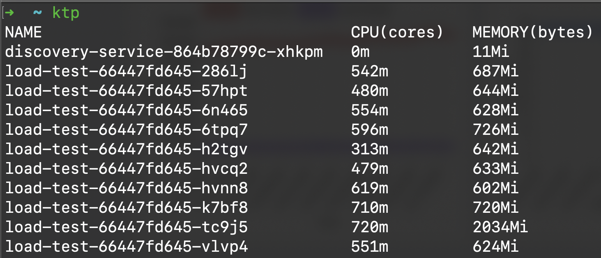

# Table of Contents
- [Intro](#intro)
- [Features](#features)
- [Installation](#installation)
- [Usage](#usage)
   * [Setting Up the Adapter](#setting-up-the-adapter)
   * [Running the Discovery Service](#running-the-discovery-service)
- [Options](#options)
- [Benchmark](#benchmark)
- [Examples](#examples)
- [Customization](#customization)
- [About socket.rooms](#about-socketrooms)
- [Performance](#performance)
   * [About addAll, delAll, broadcastWithAck](#about-addall-delall-broadcastwithack)
   * [About broadcasting](#about-broadcasting)
   * [Tuning performance in production](#tuning-performance-in-production)

# Intro


Socket.IO Mesh Adapter is a custom Socket.IO adapter designed to enable horizontal scaling of Socket.IO applications using a **mesh network architecture**. Unlike traditional pub/sub-based adapters that rely on a centralized broker (which can become a bottleneck), this adapter allows **server-to-server communication** in a decentralized manner, making it ideal for distributed systems.

# Features

- **Horizontal Scaling**: Scale your Socket.IO application across multiple servers without relying on a centralized pub/sub broker.
- **Decentralized Communication**: Servers communicate directly with each other using WebSocket connections.
- **Discovery Service**: Automatically discover and connect servers in the mesh network.
- **Namespace Support**: Each namespace can have its own adapter instance.
- **Efficient Messaging**: Broadcast messages, fetch sockets, and manage rooms across servers seamlessly.

# Installation

Install the package via npm:

```bash
npm install socket.io-mesh-adapter
```

# Usage
## Setting Up the Adapter

To use the adapter, you need to configure it with your Socket.IO server. Here's an example:
```js
const { createServer } = require("http");
const { Server } = require("socket.io");
const { createAdapter } = require("socket.io-mesh-adapter");

const httpServer = createServer();
const io = new Server(httpServer);

// Configure the adapter
const wsPort = 4000; // WebSocket port for server-to-server communication
const serverAddress = `ws://localhost:${wsPort}`
const discoveryServiceAddress = "ws://localhost:8000"; // Discovery service address

io.adapter(createAdapter({ wsPort, serverAddress, discoveryServiceAddress }));

httpServer.listen(3000, () => {
  console.log("Socket.IO server is running on port 3000");
});
```

## Running the Discovery Service
The discovery service is responsible for maintaining a list of active servers in the mesh network. You can run it using the provided binary:

```
npx socket.io-mesh-adapter@latest
```

The discovery service listens on port `8000` by default. You can change the port using the `PORT` environment variable.

# Options

The `createAdapter` function accepts the following options:

- `wsPort` (optional): The WebSocket port for server-to-server communication (default: `4000`).
- `serverAddress` (optional): The WebSocket address of the server (default: `ws://localhost:<wsPort>`).
- `discoveryServiceAddress` (required): The WebSocket address of the discovery service.

# Benchmark

The benchmark is done with example app deployed on Kubernetes:
- 10 server instances, no CPU/RAM limit
- 10 Jobs, each generates 30K connections


As shown above, we're able to reach `>300k concurrent connections`, while local users remains low, CPU at peak time also not high:



# Examples

See [examples folder](./examples/) to see how to deploy your app with Mesh adapter with Kubernetes/Docker or local

# Customization

Any method of the adapter can be overriden. You can create your own adapter and extends from MeshAdapter

```js
class CustomAdapter extends MeshAdapter {

  async broadcast(packet: any, opts: BroadcastOptions) {

  }
}
```

# About socket.rooms

In normal scenarios, `socket.rooms` would return immediately, but in case of MeshAdapter, it'll call `socketRooms` under the hood, which returns a Promise. So make sure to `await ` for it:

```js
console.log(await socket.rooms)
```

# Performance

## About addAll, delAll, broadcastWithAck

The 3 methods: addAll, delAll, broadcastWithAck are currently not implemented, if you call it, it'll just have effect on current server.

There're few reasons we leave it to you to implement them on your need:
- `addAll` is called on a client connected, `join` a room,...
- `delAll` is called on client disconnected

This is expensive in case you have many users, because on every user connect/disconnect it'll broadcast to other servers to `addAll/delAll` which degrades overall performance

`broadcastWithAck` is more complicated if we need to cover every use case, since each server can reply in different times when receiving an `emit` from client

Hence, we encourage you to implement the methods yourself, at your own cost

## About broadcasting

In case you have many users, broadcasting messages maybe costly, whether you target to local users (by using `.local.emit()) or global users. Below there are few tips for you

1. Broadcast directly to client if possible:
```js
// Good ✅
socket.emit('message', data)

// Bad ❌
namespace.to(socket.id).emit('message', data)
```

2. Broadcast to local clients if possible:
```js
// Good ✅
io.local.emit('not_important_message', data)

// Bad ❌: this will broadcast to all users globally
io.emit('not_important_message', data)
```

## Tuning performance in production

Below we have a Live chat app deployed in a common architecture on Kubernetes, in this case we take Digital Ocean as an example (other cloud providers should have similar problems)


In this case, the performance of our app depends on various factors, the ones marked as 🔼 indicate they can be scalable to achieve better performance:
- Load balancer: each LB node can handle 10k connections, this "node" is LB node itself not Kubernetes node. Hence, to handle more users we need to increase more LB nodes
- Nginx Ingress Controller: the ingress controller jobs is to forward requests to Live app deployment, more users will cause ingress controller high load. We need to scale this up in case of high traffic as well
- K8S deployment: as we're using Mesh adapter, more pods helps us handle more users
- K8S nodes: in case there's not enough resources in K8S cluster, we need to scale more nodes

> The benchmark is done by spawn Jobs in same namespace and send traffic directly to app pods, which by pass the LB + Ingress controller and gives best performance

By this example, you can see that in production you may need to do more things in order to boost your app performance